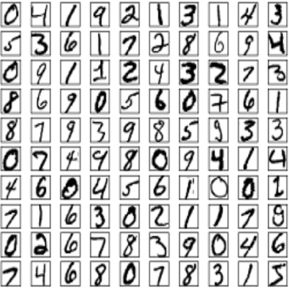
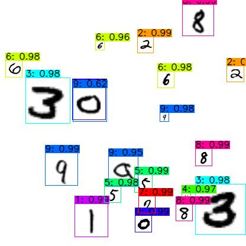

## Intorduction

A lot of wonderful datasets are now available online, such as COCO or Imagenet. which is challenging the limits of computer vision. But it's not easy for us to do some small experiments with such a large number of images to quickly test the validity of algorithmn. For these reasons I create a small dataset named "yymnist" to do classification and objection.


| classification | object detection |
|---|---
|||

## Installation

Clone this repo and install some dependencies

```
$ pip install opencv-python
$ git clone https://github.com/YunYang1994/yymnist.git
```

## Classification

If you want to use this dataset for classification, just use `mnist` folder. Each image in the folder starts with a name of its label. For example:

```
mnist/train/0_32970.pgm -> 0
mnist/train/5_12156.pgm -> 5
```
## Objection Detection

```
$ python make_data.py --num 2000
```
you will get 2000 pictures in the folder `./Images` and a `label.txt` in the `Annotations`. As for `label.txt`

```
# image_path x_min, y_min, x_max, y_max, class_id  x_min, y_min ,..., class_id 
```


